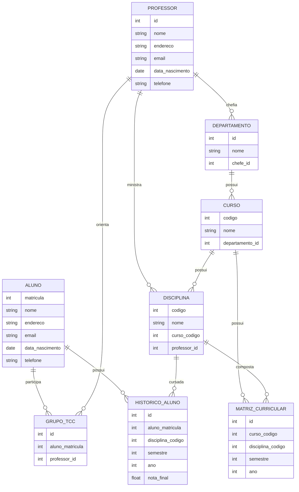

# Projeto: Sistema de Banco de Dados para Faculdade

**Integrantes do grupo:**
- Nome: Khaled Hazime Guimarães
- Matrícula: 24.124.091-4

---

## Descrição do Projeto
Este projeto consiste na criação de um sistema de banco de dados relacional para gerenciar as operações de uma faculdade, abrangendo informações sobre alunos, professores, cursos, departamentos, disciplinas e a matriz curricular dos cursos. O sistema permitirá a extração de diversos relatórios úteis para a gestão acadêmica.

## Diagrama Relacional

## Instruções para Executar o Código
1. Clone o repositório para sua máquina local.
2. Certifique-se de ter o MySQL ou outro SGBD compatível instalado.
3. Crie um banco de dados chamado `faculdade`.
4. Execute o script `create_tables.sql` para criar todas as tabelas necessárias.
5. Execute o script `insert_data.py` para gerar e inserir dados aleatórios nas tabelas.
6. Utilize as queries disponíveis no arquivo `queries.sql` para gerar os relatórios desejados.